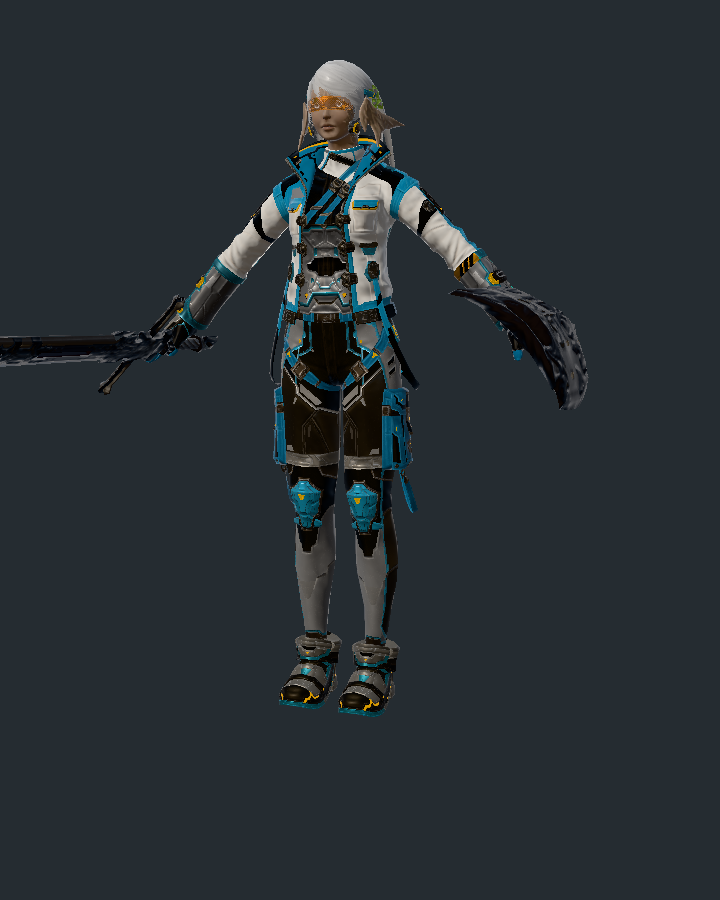
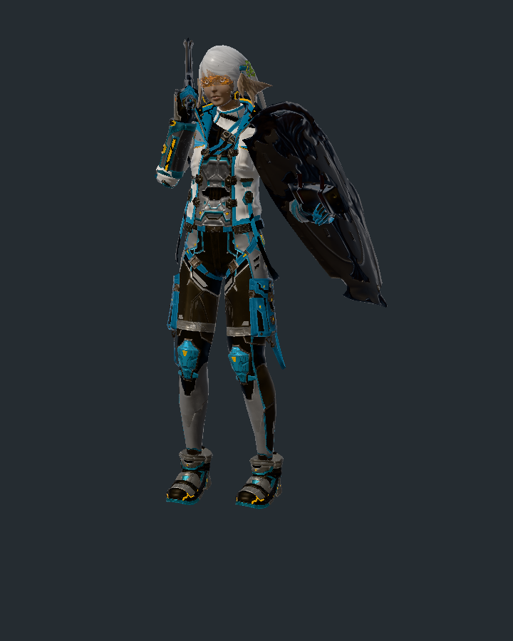

# dev：幻化与 VFX 整合

2026-10-06。整合基线 `c93b36a`；glamour 已提交功能 `c6b41b8`、`3a76f44`，当前未提交工作固定为快照 `11c7968f`，源工作区保持原样。已完成验证并合入本地 dev，尚未推送远端。

## 范围

- 幻化套装管理、逐件换装与双通道染色、主副手武器挂接、种族模型回退、身体/装备遮蔽与体型缩放。
- 单模型武器 VFX 保留逐帧挂载、Aura 和全部原有降级提示；共享场景绘制入口支持多实例和 VFX 批次，跨实例透明排序与 VFX 深度/屏幕采样共用场景。
- 武器/装备共用 `imc.rs` 解析器；装备显隐位与 VfxId 从同一条目读取，移除装备模块的重复 IMC 类型、解析器与入口，并迁移测试。
- 原生单模型/场景快照共用 GPU 授权开关、进程内 Instance、全局串行锁与浏览器资源限额。单模型网页实例消费骨架，rest 体型缩放与动画采用同一关节路径。

解决冲突的文件：CHANGELOG、Tailwind 生成文件、data weapon_models、render context/test_support、网页画布/模型页/资源层及应用 weapon_models 导出。Tailwind 重新生成，保留两条线使用的样式。

## 验证

普通 workspace 1799 项通过（data 1449、renderer 203，另有应用/集成测试）；Web/WASM 编译通过。356 个普通忽略项不计为通过。原生 GPU：多实例+VFX 1x/4x、真实剑盾 rest/动画、#16053/#16063 挂载 1x/4x 均通过，共 24 个定向快照。

原生验收范围：多实例+VFX 1x/4x 与同条件合并网格对照、真实剑盾穿搭 rest/动画、#16053/#16063 实际挂载 1x/4x。

日志改存本机独立目录 `/tmp/xiv-companion-glamour-vfx-verification-20261006/`；先前共享构建目录及其中日志被清理后，使用整合工作区的独立缓存复核并保留记录。[当前整合源码摘要和验收记录](dev-glamour-vfx-verification.json)另行维护；首版 `vfx-v1-verification.json` 为此前候选源码的历史验收。

## 后续边界

幻化页面自动加载每件武器的挂载 VFX 并跟随角色动画，仍需接入对应宿主/资源链；本次整合不把渲染器共享入口视为这项产品能力已完成。VFX 的游戏画面一致性、完整场景输入，以及部分装备/角色骨骼近似继续留在覆盖记录。取景仍使用未缩放 bounds，超长武器可能被裁出画面。

main 保持 `ce20f59`；本次仅整合到本地 dev，远端尚未推送。原 dev 和 glamour 工作区的未提交开发继续保留。





## 复现

```sh
cargo test --workspace --features game-data,render-test-support,web --no-fail-fast
cargo check --target wasm32-unknown-unknown --features web
node scripts/check-vfx-progress.cjs

XIV_ALLOW_GPU_TESTS=1 cargo test --features game-data,render-test-support,web \
  --test vfx_render_semantics multi_instance_scene_keeps_models_and_vfx_at_1x_and_4x \
  -- --ignored --exact --test-threads=1
XIV_ALLOW_GPU_TESTS=1 XIV_GAME_DIR="$GAME_DIR" cargo test --features game-data,render-test-support,web \
  --test native_dressed_character installed::render_dressed_au_ra_e0908_sword_shield \
  -- --ignored --exact --test-threads=1
XIV_ALLOW_GPU_TESTS=1 XIV_GAME_DIR="$GAME_DIR" VFX_SMOKE_ITEM=16053,16063 \
  cargo test --features game-data,render-test-support,web --test weapon_vfx_real_smoke \
  render_installed_weapon_vfx_smoke -- --ignored --exact --test-threads=1
# 同一真实挂载命令添加 VFX_SMOKE_MSAA=4，进行 4x 验收。
```

`GAME_DIR` 指向游戏 `game` 目录。GPU 验收按单进程、单线程、有限用例运行；本机使用 NVIDIA Vulkan ICD，无开发服务器。
