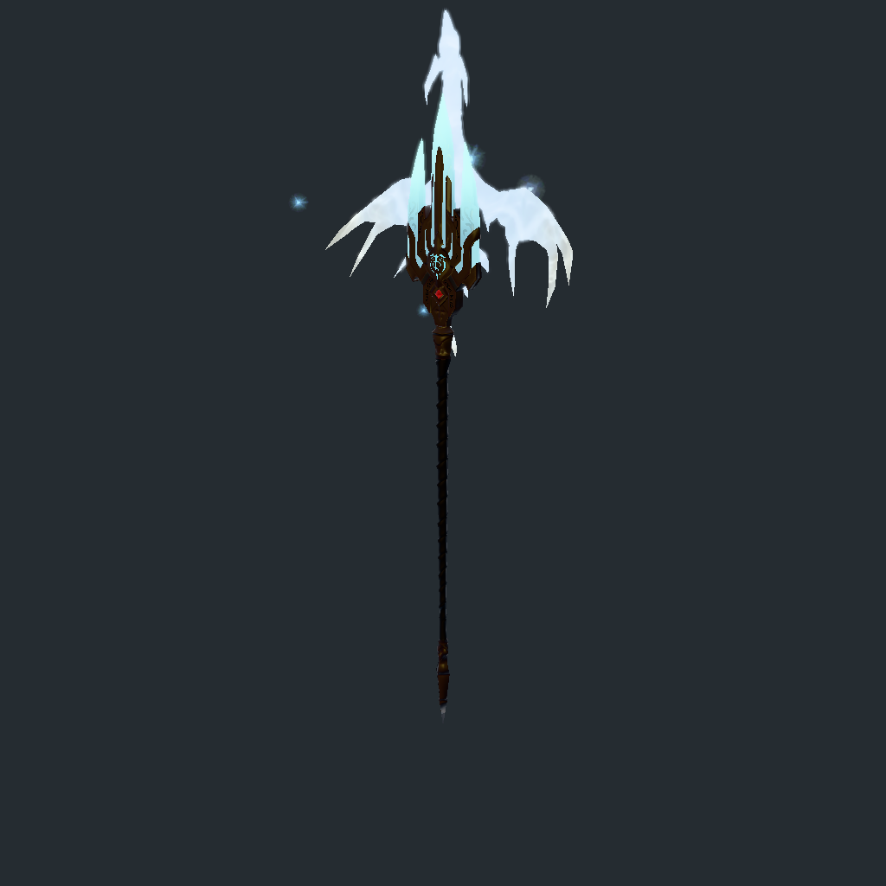
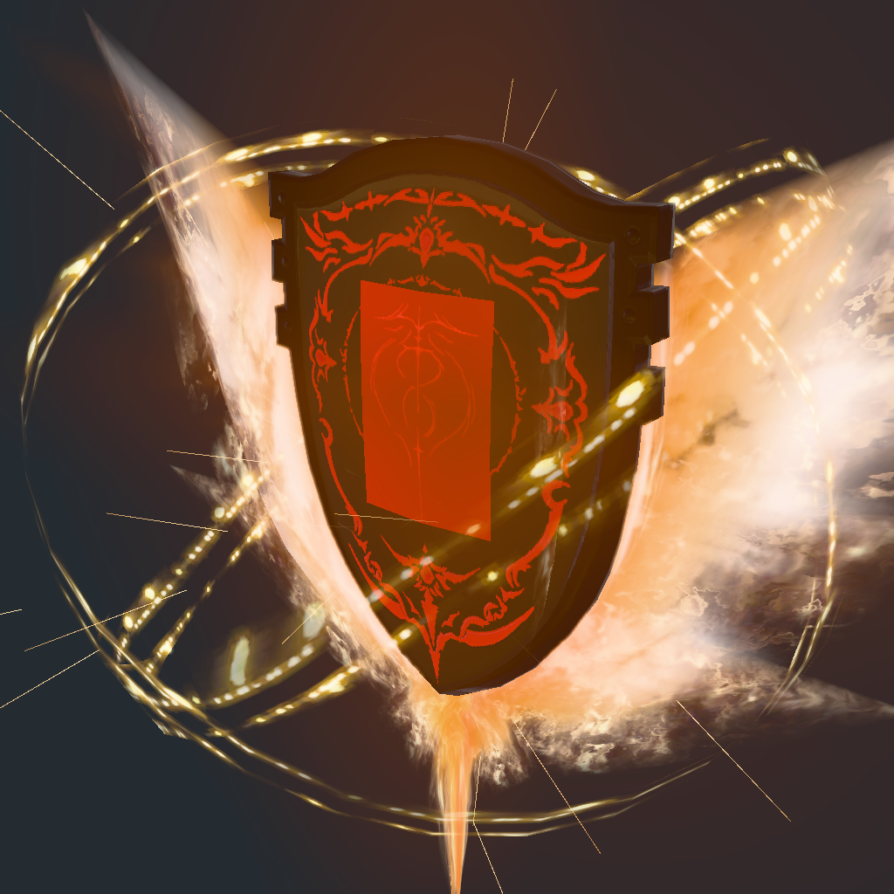

# 武器 VFX 首个可用版本

本版目标是先将可用的武器特效预览合入 `dev`。完整字段、全部特效类型与游戏画面精确一致性属于后续覆盖，不作为本版合入条件。

首版代码提交：`8e07bd5`（候选分支 `release/vfx-preview-v1`）；已于 2026-10-06 将候选提交 `583065c` 快进合入本地 `dev`，尚未推送远端。独立候选的普通 workspace 与 Web/WASM 检查均通过，合入时 11 项源码摘要仍与验收记录一致。[源码摘要与验证记录](vfx-v1-verification.json)保留验收范围。

2026-10-06 的幻化/VFX 共享渲染整合使用 [单独的范围与验收记录](dev-glamour-vfx-integration.md)；本页及原源码摘要保留为首版候选的历史验收。

当前状态以 [进度页](vfx-progress.html) 为准：上半部分维护本版合入条件，下半部分维护实际覆盖和后续缺口。`verified` 仅表示本版列明的条件通过。

## 支持范围

- 从武器 IMC 加载挂载 AVFX，读取贴图、绘制模型及基础骨架/绑点，保留主、副手独立资源。
- 显示常见点状/四边形粒子、网格火焰及武器表面 Aura；部分其它粒子族、Decal 和绑定配置已有可用子集，未支持配置保留诊断。
- 逐帧播放，支持特效启停、重播与物品切换。初始化失败显示错误，特效相机更新失败仍绘制基础模型。
- 同类限制按问题类型汇总。展开可查看全部粒子编号、路径和原始原因，参数值不同的限制不会误合并。

### 已知视觉差异

逐粒子 tone-map、场景雾、全部粒子光照和完整场景合成尚未覆盖。屠龙戟的蓝色火焰可能偏白、偏亮；盾面材质及其它纹理也仍有近似差异。角色/召唤兽宿主、完整 Binder/Clip 与生命周期组合、部分 Polyline/Smpl/LOD 配置，以及游戏同条件动态/像素对照留待后续。

截图中的 18 条 `bATM` 提示，来自新增诊断按粒子逐条输出。旧代码已解析该开关但未报告对应缺口；并非新增了 18 项独立退化。本版保留该诊断，并在页面汇总为一种亮度差异。

## Verification

2026-10-04 在 NVIDIA RTX 4070 Ti SUPER、Vulkan、驱动 595.104.02 上验证：

| 检查 | 结果 | 边界 |
| --- | --- | --- |
| #16053 屠龙戟·灵光，#16063 圣母盾·灵光 | 原生 1x/4x 均通过 | 两份实际安装资源；逐帧输入与 Aura 选择匹配网页，不承诺所有武器 |
| 实际挂载可见性 | 区别于无 VFX 基线 | 保留原始像素差异断言，不以增亮诊断粒子替代真实挂载结果 |
| 初期及常驻快照 | 共 16 份快照完成 | 含基线、诊断增亮、0.8 秒真实挂载及 4 秒常驻；常驻快照不作为游戏像素一致性证明 |
| 普通 workspace 回归 | 全部通过 | 使用 `game-data,render-test-support,web`；data 1409、renderer 199，另有应用/集成用例。忽略项不计通过 |
| Web/WASM | 编译通过 | 编译不代替浏览器 shader 编译或实际页面显示 |
| Chromium 154 WebGPU | 五份生成 WGSL 零错误 | 旧 VFX shader 906:26 错误可复现；模型、VFX、后处理、Decal 1x/4x 均通过 |
| 法线/反射 | 20 份原生像素快照通过 | 定向回归，覆盖 1x/4x 和屏幕反射来源 |
| 资源限额 | 原生 1x/4x 管线及绑定通过 | 使用浏览器相同资源限额；旧 storage limit 1/count 2 可复现 |
| 诊断和进度页 | 分组与加载/恢复检查通过 | 完整来源保留；DOM 模拟验证失败/恢复，另用 Chromium 实际验证 file 页面、6项检查、8个覆盖领域和两张图片加载 |




此前 #16063 离屏冒烟只跳到指定时间，且未选择网页绘制的 Aura，出现与基线相同的结果。修改用例以提供初始零输入、60Hz 输入及网页相同的 Aura 选择后，真实挂载断言通过；这不代表任意大步长与逐帧播放应产生相同状态。

### 可复现命令

```sh
cargo test --workspace --features game-data,render-test-support,web --no-fail-fast
cargo check --target wasm32-unknown-unknown --features web
node scripts/check-vfx-progress.cjs

# GAME_DIR 指向实际游戏的 game 目录。GPU 测试按单线程运行。
XIV_ALLOW_GPU_TESTS=1 XIV_GAME_DIR="$GAME_DIR" VFX_SMOKE_ITEM=16053,16063 \
  cargo test --features game-data,render-test-support \
  --test weapon_vfx_real_smoke render_installed_weapon_vfx_smoke \
  -- --ignored --exact --test-threads=1 --nocapture

# 同一代表性集合的 4x 验收。
XIV_ALLOW_GPU_TESTS=1 XIV_GAME_DIR="$GAME_DIR" VFX_SMOKE_ITEM=16053,16063 VFX_SMOKE_MSAA=4 \
  cargo test --features game-data,render-test-support \
  --test weapon_vfx_real_smoke render_installed_weapon_vfx_smoke \
  -- --ignored --exact --test-threads=1 --nocapture
```

`scripts/check-browser-shaders.mjs` 接受构建生成的 WGSL 路径，可一次验证五个模块。它使用独立 headless Chromium 配置及现有本地来源，不启动开发服务器；默认来源 `http://127.0.0.1:8080`，可用 `XIV_SHADER_CHECK_ORIGIN` 指定已运行的来源。该脚本只验证真实浏览器 shader 编译，不做性能或页面画面对照。

```sh
node scripts/check-browser-shaders.mjs \
  "$SHADER_DIR/vfx.wgsl" "$SHADER_DIR/model.wgsl" "$SHADER_DIR/postprocess.wgsl" \
  "$SHADER_DIR/vfx_decal_1x.wgsl" "$SHADER_DIR/vfx_decal_4x.wgsl"
```

本机本轮完整日志位于 `target/weapon-vfx-audit/vfx-v1-{workspace,wasm,real-gpu-1x,real-gpu-4x}.log`，浏览器与历史回归说明位于同目录的 `vfx-uniform-sampling-*`、`browser-device-limits-*`。日志不是使用预览或阅读覆盖记录的前置条件。

## Merge

2026-10-06 已将独立 `release/vfx-preview-v1` 分支快进合入本地 `dev`，包含候选提交 `583065c`；干净的 dev 工作区为 `../xiv-companion-dev`。远端 `origin/dev` 尚未推送。保留应用、运行时、回归夹具、普通验证及覆盖文档；原始客户端指令执行探针和依赖临时原字节产物的大规模研究验收留在原工作区。本版合入包不新增客户端可执行字节。

本次 dev 从 `d695be5` 快进 22 个提交；合入没有改动验收过的运行时代码。此前误做的本地 main 合入已撤回，main 恢复到 `ce20f59`。原 dev 工作区 `../xiv-companion` 的未提交开发原样保留在 `wip/dev-before-vfx-preview-v1` 分支，没有混入本版；VFX 研究工作区保留。

合入检查：代表性预览可见；构建/普通测试通过；浏览器编译通过；降级提示可理解；覆盖记录可维护；候选工作区和合入差异可审查。完整游戏画面一致性不列入本版检查。

维护规则：新增能力先更新进度数据的 `coverage`，注明支持的子集和未覆盖的条件；新增代表性资源验收才扩展样本集合。不以探针数量、测试数量或枚举解析数推算功能百分比。
